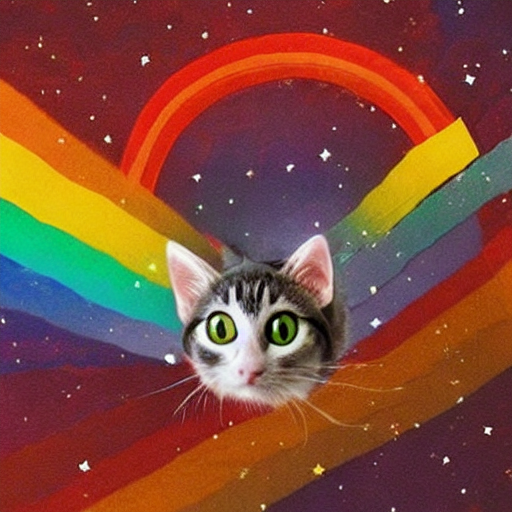
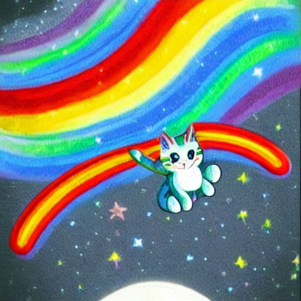
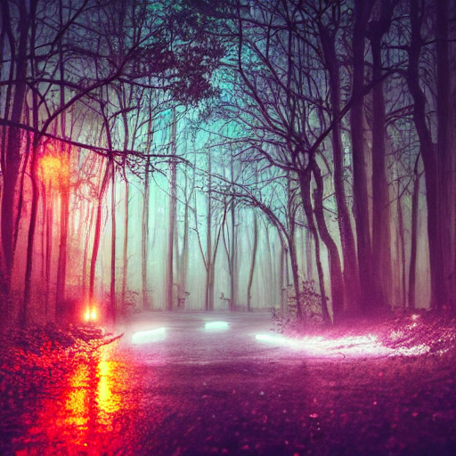
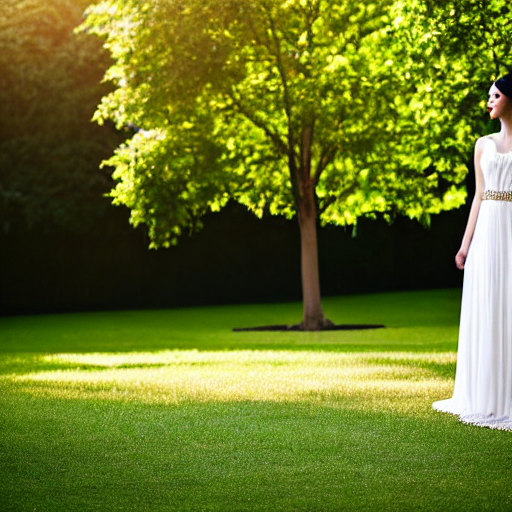
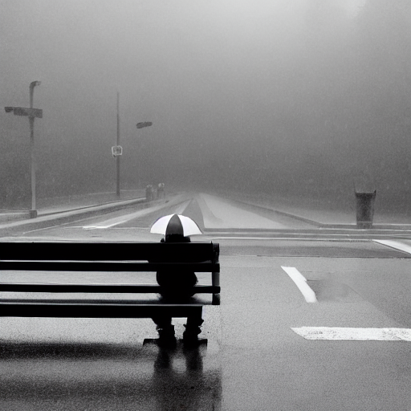
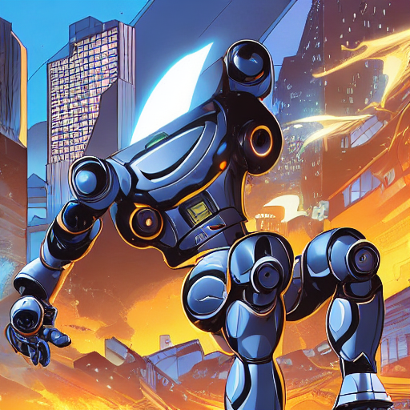
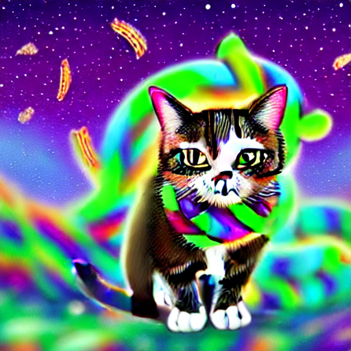

# 🎨 프롬프트 엔지니어링 워크숍 포트폴리오

> Stable Diffusion AI를 활용한 이미지 생성 실습 결과물

## 👤 수강생 정보

| 항목 | 내용 |
|------|------|
| **이름** | 미입력 |
| **학번** | 미입력 |
| **작성일** | 2026년 01월 23일 |
| **총 작품 수** | 9개 |

---

## 📚 회차별 학습 기록

### 📖 1회차: 첫 AI 이미지 생성

**학습 기법**: 기본 프롬프팅

#### 작품 1

| 항목 | 내용 |
|------|------|
| **프롬프트** | `a cute rainbow cat  flying in space` |
| **네거티브** | `-` |
| **생성 시간** | 2026-01-23 05:41:27 |

> AI에게 명령을 내리는 프롬프트에도 여러가지 종류의 방법이 있고, 이 방법들을 다양하고 세밀하게 사용할 수 록 AI가 더더욱 정밀한 결과를 내준다는 것을 배움.

---

### 📖 2회차: Zero-shot vs Detail

**학습 기법**: 상세 프롬프팅

#### 작품 1

| 항목 | 내용 |
|------|------|
| **프롬프트** | ` cat` |
| **네거티브** | `-` |
| **생성 시간** | 2026-01-23 05:48:52 |

> 단순한 랜덤 고양이를 생성하는 제로-샷과 달리, 세부입력을 통한 프롬프트는 내가 원하는 고양이의 이미지를 거의 비슷하게 생성해내었다.

#### 작품 2

| 항목 | 내용 |
|------|------|
| **프롬프트** | ` cat` |
| **네거티브** | `-` |
| **생성 시간** | 2026-01-23 05:48:57 |

> 단순한 랜덤 고양이를 생성하는 제로-샷과 달리, 세부입력을 통한 프롬프트는 내가 원하는 고양이의 이미지를 거의 비슷하게 생성해내었다.

#### 작품 3

| 항목 | 내용 |
|------|------|
| **프롬프트** | `a cute rainbow cat flying in space.` |
| **네거티브** | `-` |
| **생성 시간** | 2026-01-23 05:48:57 |

> 단순한 랜덤 고양이를 생성하는 제로-샷과 달리, 세부입력을 통한 프롬프트는 내가 원하는 고양이의 이미지를 거의 비슷하게 생성해내었다.

---

### 📖 3회차: Persona & Style

**학습 기법**: 스타일 프롬프팅

#### 작품 1

| 항목 | 내용 |
|------|------|
| **프롬프트** | `a forest, animal, silence, twilight, scared, cyberpunk style, neon lights, rain, futuristic city, dark atmosphere, neon lighting, colorful glow, night, wide shot, panoramic view` |
| **네거티브** | `-` |
| **생성 시간** | 2026-01-23 05:54:08 |

> AI가 각 컨셉에 맞는 이미지를 이해하고 생성하는 것이 가능하다는 것도 확인함.

---

### 📖 4회차: Negative Prompting

**학습 기법**: 네거티브 프롬프팅

#### 작품 1

| 항목 | 내용 |
|------|------|
| **프롬프트** | `a beautiful portrait of a young woman, elegant dress, garden background, soft lighting` |
| **네거티브** | `bad hands, extra fingers, mutated hands, poorly drawn face, mutation, deformed, ugly` |
| **생성 시간** | 2026-01-23 06:23:08 |

> 적당한 명령으로 과포화 되지 않게 조심해야함.

---

### 📖 5회차: Step-back Prompting

**학습 기법**: 추상화 프롬프팅

#### 작품 1

| 항목 | 내용 |
|------|------|
| **프롬프트** | `a person sitting alone on an empty bench, rainy day, view from behind, grey cloudy sky, melancholic atmosphere` |
| **네거티브** | `blurry, low quality, distorted, text, watermark` |
| **생성 시간** | 2026-01-23 06:29:22 |

> 같은 제시어라도 주제에 따라 완전히 다른 이미지가 연상될 수 있기 때문에 내가 그릴려고 하는 이미지는 무엇인가를 확실하게 정의해야함.

---

### 📖 6회차: Chain of Thought

**학습 기법**: 레이어 빌딩

#### 작품 1

| 항목 | 내용 |
|------|------|
| **프롬프트** | `a  coalescence robot, fight, city, dynamic` |
| **네거티브** | `blurry, low quality` |
| **생성 시간** | 2026-01-23 06:35:28 |

> 레이어를 하나씩 설정하니 이전 이미지 생성 결과를 토대로 더 관련성 있게 생성함.

---

### 📖 7회차: 종합 실습

**학습 기법**: 종합

#### 작품 1

| 항목 | 내용 |
|------|------|
| **프롬프트** | `
A cat wearing a Pop-Tart knot leaves its tail behind to take over space., fantasy art, magical, epic, detailed illustration, highly detailed, sharp focus, 8k resolution` |
| **네거티브** | `realism, extra hands and foots` |
| **생성 시간** | 2026-01-23 06:40:14 |

> 생각보다 잘 나오지 않음

---

## 🏆 Best 작품

**선택한 작품**: 

**선택 이유**: 

---

## 💡 워크숍 후기

---

## 🛠️ 사용 기술

- Stable Diffusion
- Streamlit
- Google Colab + ngrok

---

<i>🎓 KNU 프롬프트 엔지니어링 워크숍 수료</i>

